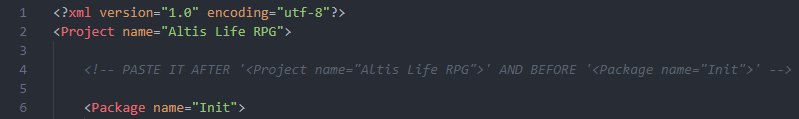

# CXP MAP FILTER MANUAL

Open the downloaded package and follow instructions below.

1. Copy the **mapFilter\\** folder into your **missionName.Map\\cxp\\** folder.
2. Open the following files and add the corresponding lines to each one:
    - On **cxp\\cxp_cfgs.cpp** file add:
    ```sqf
    #include "mapFilter\config.cpp"
    ```
    - On **cxp\\cxp_dialogs.cpp** file add:
    ```sqf
    #include "mapFilter\dialogs.cpp"
    ```
    - On **cxp\\cxp_functions.cpp** file add:
    ```sqf
    #include "mapFilter\functions.cpp"
    ```
    - On **cxp\\cxp_notifications.cpp** file add:
    ```sqf
    #include "mapFilter\notifications.cpp"
    ```

3. Open the provided **stringtable.xml** file and copy all it's content, and paste it inside your **missionName.Map\\stringtable.xml** file, as follows:

    **Example (line 4):**

    

## Further Instructions

Any further configuration instructions can be found inside the product's **mapFilter\\config.cpp** file.
